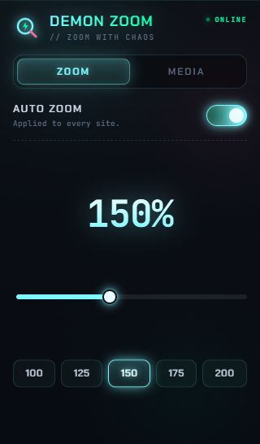
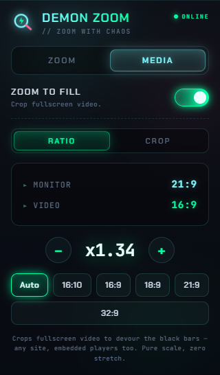
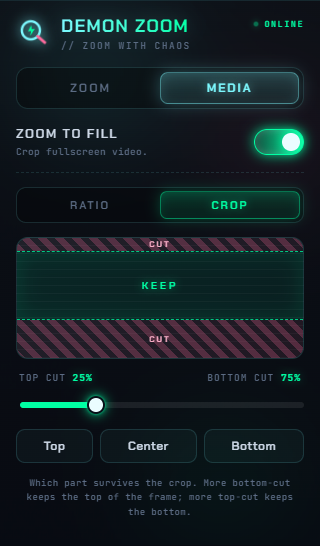
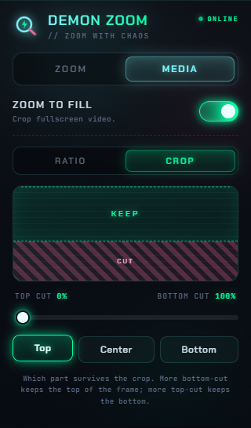
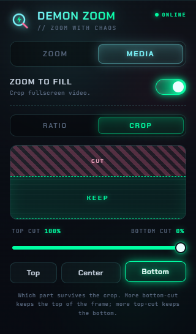

<div align="center">


<br/><br/>


</div>

---

## ⚡ What is this?

**Demon Zoom** is a Chrome / Comet extension that does two brutally useful things and gets out of your way:

1. **Auto-zooms every website** to your chosen level (default **150%**) the instant it loads — and *keeps* it there, even after a refresh.
2. **Zooms video to fill ultrawide monitors** — devouring the black bars on YouTube, anime sites, and embedded players — with **zero stretching**.

Set it once. It works forever. No per-site fiddling, no settings hunts.

---

## 🖥️ A look inside

<div align="center">
<table>
  <tr>
    <td align="center" width="33%"><br/><sub><b>ZOOM</b> — force every site to 150%</sub></td>
    <td align="center" width="33%"><br/><sub><b>MEDIA · RATIO</b> — fill the screen</sub></td>
    <td align="center" width="33%"><br/><sub><b>MEDIA · CROP</b> — aim the crop</sub></td>
  </tr>
</table>
</div>

---

## ✨ Features

| | |
|---|---|
| 🔍 **Auto page zoom** | Every site snaps to your level on load — and a reactive snap-back keeps it there through refreshes and navigation. |
| 🎚️ **Slider + presets** | Dial 50–300%, or tap a preset (100 · 125 · 150 · 175 · 200). |
| 🎬 **Zoom-to-fill** | Crops video to fill your ultrawide in fullscreen — a pure uniform scale, so **nothing is stretched**. |
| 📐 **Live ratio detection** | Auto-detects your **monitor** aspect ratio (any display) and the **video** ratio in real time, then computes the fill factor (e.g. `x1.34`). |
| ✂️ **Crop alignment** | Decide how much is trimmed from the **top** vs the **bottom** — with a live preview. Default **25% top / 75% bottom**. |
| 🎛️ **Independent toggles** | Separate on/off switches for page zoom and media crop. |
| 💾 **Persistent everywhere** | Saved via `chrome.storage.sync` and applied across every tab automatically. |
| 🎨 **Neon cyberpunk UI** | Bundled fonts, animated glow, sliding tabs — and **zero external calls or telemetry**. |

---

## 🚀 Installation

```bash
git clone https://github.com/GS-Tejas-hub/Demon-Zoom.git
```

1. Open **`chrome://extensions`** (or **`comet://extensions`**).
2. Flip on **Developer mode** (top-right).
3. Click **Load unpacked** and select the **`Demon-Zoom`** folder.
4. Pin it to your toolbar — done. ⚡

> Requires host access (`<all_urls>`) to zoom pages and crop videos on every site. It talks to no servers — everything runs locally.

---

## 🎮 Usage

### ⚡ Zoom
Open the popup → **ZOOM** tab. Toggle it on and pick a level with the slider or a preset. Every site now loads at that zoom and **holds it** — refresh included.

### 🎬 Media → Ratio
Switch to the **MEDIA** tab and flip on **Zoom to fill**. It shows your detected **Monitor** and **Video** ratios and the resulting zoom factor. Leave it on **Auto** (fills your real monitor) or force a specific ratio: `16:10 · 16:9 · 18:9 · 21:9 · 32:9`. Fine-tune with **− / +**.

> Cropping kicks in **only in fullscreen**, where the black bars actually appear — so in-page players and layouts are never touched.

### ✂️ Media → Crop
Filling an ultrawide with a 16:9 video means trimming the top and bottom. The **CROP** sub-tab lets you choose **where** that trim comes from — because sometimes the action's up top, sometimes the subtitles are down low.

<div align="center">
<table>
  <tr>
    <td align="center"><br/><sub><b>Top</b> — keep the top, trim the bottom</sub></td>
    <td align="center"><br/><sub><b>Bottom</b> — keep the bottom, trim the top</sub></td>
  </tr>
</table>
</div>

Use the **Top / Center / Bottom** presets or the split slider for anything in between. The default trims **75% from the bottom, 25% from the top**, so you keep more of the frame's upper half.

---

## 🧠 How it works

**Page zoom** — a Manifest V3 service worker (`background.js`) applies `chrome.tabs.setZoom` on every navigation, and listens to `chrome.tabs.onZoomChange` to *snap the zoom back* whenever the browser tries to reset it. That's what makes it survive refreshes.

**Video crop** — a content script (`content.js`) runs in **every frame** (so embedded/iframe players work too). It finds each `<video>`, and when it's fullscreen it applies:

```css
transform: scale(<fill-factor>);
transform-origin: 50% <top-cut>%;   /* 0% = trim bottom · 100% = trim top */
```

The fill factor is derived from your monitor and the video's aspect ratio, and `transform-origin` steers the crop. A `ResizeObserver` + `MutationObserver` keep it correct as players resize or rebuild themselves — no stretching, ever.

---

## 🗂️ Project structure

```
Demon-Zoom/
├── manifest.json        # MV3 config, permissions, content script
├── background.js        # page-zoom service worker (+ snap-back)
├── content.js           # video crop-to-fill (all frames)
├── popup.html           # neon cyberpunk UI
├── popup.js             # popup logic + live previews
├── fonts/               # bundled Chakra Petch + JetBrains Mono
├── icons/               # 16 / 48 / 128 px toolbar icons
└── assets/              # screenshots
```

**Stack:** 100% vanilla JavaScript · no build step · no dependencies · no tracking.

---

## 📜 License

Released under the **MIT License** — see [`LICENSE`](LICENSE).

<div align="center">

<br/>

<sub>built with chaos by <a href="https://github.com/GS-Tejas-hub">the demon king</a> 🔥</sub>


</div>
